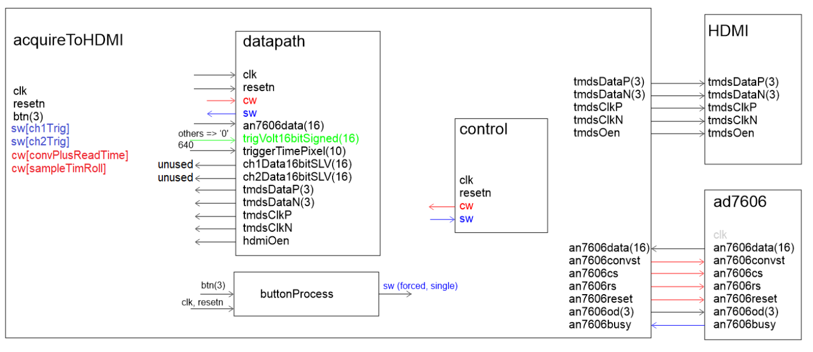
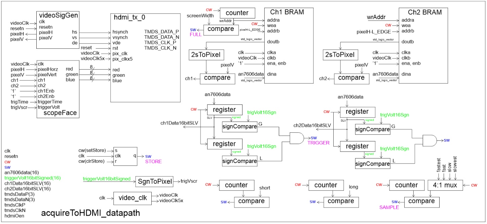
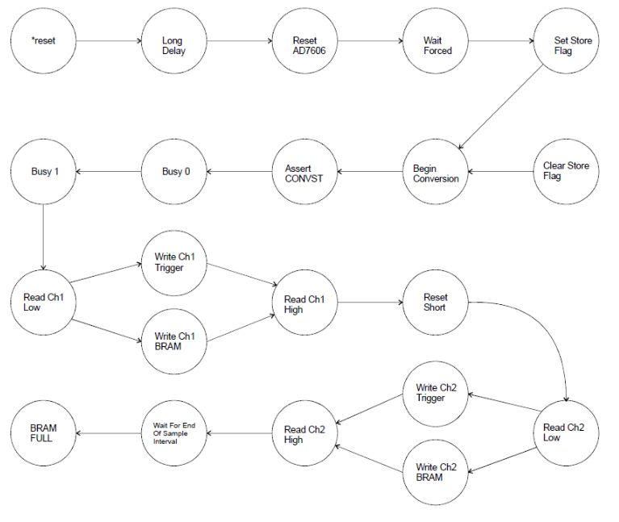

# FPGA-Based Oscilloscope Design

A complete digital oscilloscope implementation using VHDL, featuring dual-channel data acquisition and HDMI display output.

## Overview

This project implements a functional oscilloscope system on a Zynq7010 FPGA. The design captures analog signals using the AD7606 ADC and displays them in real-time via HDMI output. The oscilloscope supports both user-triggered and automatic threshold-triggered acquisition modes.

## Features

- **Dual-channel acquisition** using AD7606 ADC
- **Two operating modes:**
  - **FORCED mode**: Manual trigger via button press
  - **TRIGGERED mode**: Automatic trigger when Channel 1 crosses 0V (rising edge)
- **HDMI video output** for waveform display
- **Configurable sampling rates** (300 to 2400 clock cycles)
- **Block RAM storage** for captured waveforms
- **Real-time waveform rendering**

## Architecture

The system is organized into a hierarchical design with clear separation between control logic and data processing.

### Top-Level Module

The top-level `acquireToHDMI` module integrates the datapath and control unit, managing user inputs and LED outputs for debugging.

### Datapath Module

The datapath contains:
- AD7606 interface logic
- Dual-port Block RAMs for sample storage (Channels 1 & 2)
- Trigger detection circuitry
- Sampling rate counters
- Video pixel comparison logic for waveform rendering
- Clock generation for video output

### Control/FSM Module

The finite state machine controls:
- ADC conversion sequencing
- Data acquisition timing
- Mode selection (FORCED/TRIGGERED)
- BRAM write operations
- Trigger event detection

## Operating Modes

### FORCED Mode
In FORCED mode, the oscilloscope waits for user input. When PL_KEY4 is pressed, the system fills both channel BRAMs with sampled data from the AD7606.

### TRIGGERED Mode
In TRIGGERED mode, the oscilloscope continuously monitors Channel 1. When the input waveform crosses through 0V on a rising edge, data acquisition automatically begins and fills the BRAMs. The system then returns to waiting for the next trigger event.

## Sampling Rates

The design supports four preset sampling rates:
- **HIGHEST_RATE**: 300 clock cycles
- **HIGH_RATE**: 600 clock cycles
- **LOW_RATE**: 1200 clock cycles
- **LOWEST_RATE**: 2400 clock cycles
